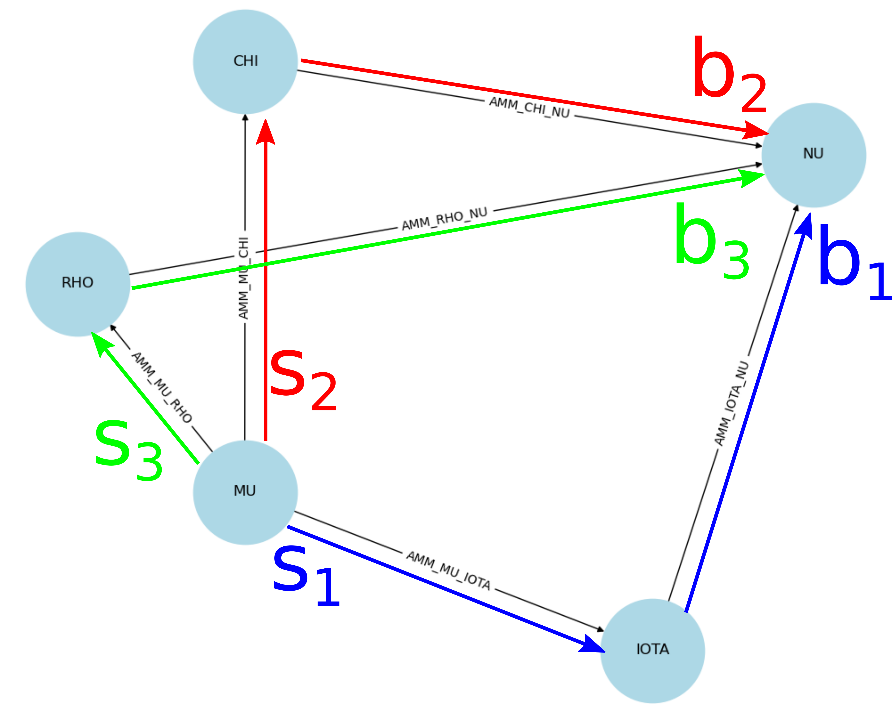

# MEV agent
<div align="center">
  
</div>

This project involves developing a Maximal Extractable Value (MEV) agent designed to optimize order execution by matching a set of order intents with various potential liquidity sources. The goal is to maximize the order's surplus through optimal execution strategies.

## Table of Contents

- [Overview](#overview)
- [Installation](#installation)
- [Usage](#usage)
- [Exercises](#exercises)
- [Documentation](#documentation)

## Overview

This project is designed to simulate a market with multiple trading venues, each with its own liquidity pool. The main components are:
- `Order`: Represents an order with user intent for trading.
- `Venue`: Represents a trading venue with token reserves.
- `Market`: Represents a market of trading venues, it is a graph with tokens at the vertices and venues at the edges.
- `Agent`: Represents a market agent that formulates and optimizes trading strategies.

The idea is that given a user `Order` containing the intent of buying `token2` and selling `token1`, with the worst acceptable exchange rate, `Agent` will read `Market` and construct a `strategy` to exchange such tokens.

`strategy` is a directed graph connecting the nodes of the different tokens by means of edges, which are the venues where the tokens at the corresponding nodes can be exchanged. 
The graph direction is from `token1` to `token2`.

<div align="center">
  
  <p style="margin-top: 10px;">Example of a strategy graph.</p>
</div>


Knowing the user intent, and the possible paths in the market connecting the desired user tokens, the `Agent` can now search for the optimal coin exchange among the directed paths to maximize the user surplus. 


With `N` being the number of simple paths connecting `token1` with `token2` in the strategy graph. 

In case the keyword `partial_fill = false` is in the user order, the condition for the total amount of coins sold will be strict equality (*Fly-or-kill* situation).

<div align="center">
  
  <p style="margin-top: 10px;">Example of a strategy graph where the coins sold and bought along the different channels are highlighted.</p>
</div>

### NOTE
Since the [forward-routing problem is convex](https://hal.science/hal-03455981/file/goroen.pdf), we don't need a global optimizer and the optimization is performed employing [scipy.optimize.minimize](scipy.optimize.minimize) employing the [Sequential Least Squares Programming (SLSQP)](https://docs.scipy.org/doc/scipy/reference/optimize.minimize-slsqp.html) solver.

## Installation

1. Clone the repository:
    ```bash
    git clone https://github.com/yourusername/mev_agent.git
    cd mev_agent
    ```

2. Install the required dependencies:
    ```bash
    pip install -r requirements.txt
    ```

## Usage
To use the code we need first to add to the system path `path-to-src`, i.e. the path to the `src` folder containing the Python codes.
Then we only need to import [`mev_project_interface`](docs/mev_project_interface.md) and run its procedure `main` specifying the JSON file containing user orders and market venues.

### Example Usage

```python
import sys
import os
import json
from matplotlib import pyplot as plt

# Add the src directory to the system path
sys.path.append(os.path.abspath(os.path.join(os.path.dirname(__file__), 'path-to-src')))
import mev_project_interface as mev_interface

# The JSON-file containing user orders and market venues
json_path = 'path-to-json/file.json'

# Run MEV agent optimization on the JSON containing user orders and venues.
mev_interface.main(json_path, plot_strategy=False) #If plot_strategy, makes the image of the directed graph

```

That when applied to the following input `test1.json`:
```json
{
    "orders": {
        "0": {
            "sell_token": "COIN1",
            "buy_token": "COIN2",
            "limit_sell_amount": "1000_000000000000000000",
            "limit_buy_amount": "900_000000000000000000",
            "partial_fill": false}
    },
    "venues": {
        "AMM_RHO_KAPPA": {
            "reserves": {
                "COIN1": "10000_000000000000000000",
                "COIN2": "200000_000000000000000000"
            }
        }
    }
}
```

Outputs on the terminal:

```console
example@example:~$ python3 mev_optimization.py
 
MEV Agent ready to maximize the surplus .. or at least trying :)
 
Status: 0
Message: Optimization terminated successfully
Number of Iterations: 2
Number of Function Evaluations: 4
Number of Gradient Evaluations: 2
 
 
The resulting total value sold   (via all paths) is: 1000.000000000000000000
The resulting total value bought (via all paths) is: 18181.818181818187440513
The resulting gamma is: 17281.818181818187440513
Total coin conservation error: 1.3642421e-12
 
The resulting total value sold via   COIN1 -> COIN2 is: 1000.000000000000000000
The resulting total value bought via COIN1 -> COIN2 is: 18181.818181818187440513
```

Moreover, an extra JSON-file called `test1-results.json` is created

```json
{
    "venues": {
        "AMM_RHO_KAPPA": {
            "sell_token": "COIN2",
            "buy_token": "COIN1",
            "ex_buy_amount": "1000_000000000000000000",
            "ex_sell_amount": "18181_818181818187440513"
        }
    },
    "orders": {
        "0": {
            "partial_fill": false,
            "buy_amount": "900_000000000000000000",
            "sell_amount": "1000_000000000000000000",
            "buy_token": "COIN2",
            "sell_token": "COIN1",
            "ex_buy_amount": "18181_818181818187440513",
            "ex_sell_amount": "1000_000000000000000000"
        }
    }
}
```
## Exercises

In the following links, I report my solutions to the exercises provided.

- [Exercise 1](exercises/first/Exercise1.md)
- [Exercise 2](exercises/second/Exercise2.md)
- [Exercise 3](exercises/third/Exercise3.md)


## Documentation

For detailed documentation, please refer to [documentation](docs/DOCUMENTATION.md).
